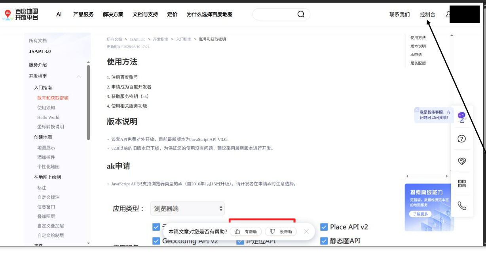
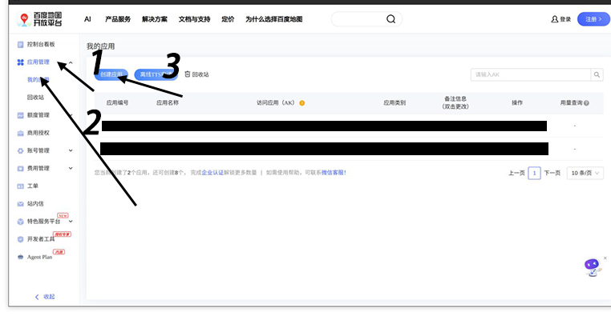
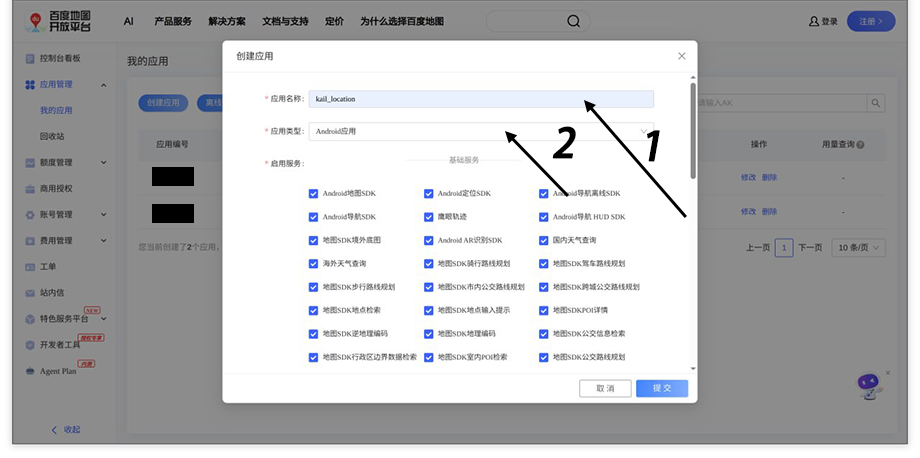
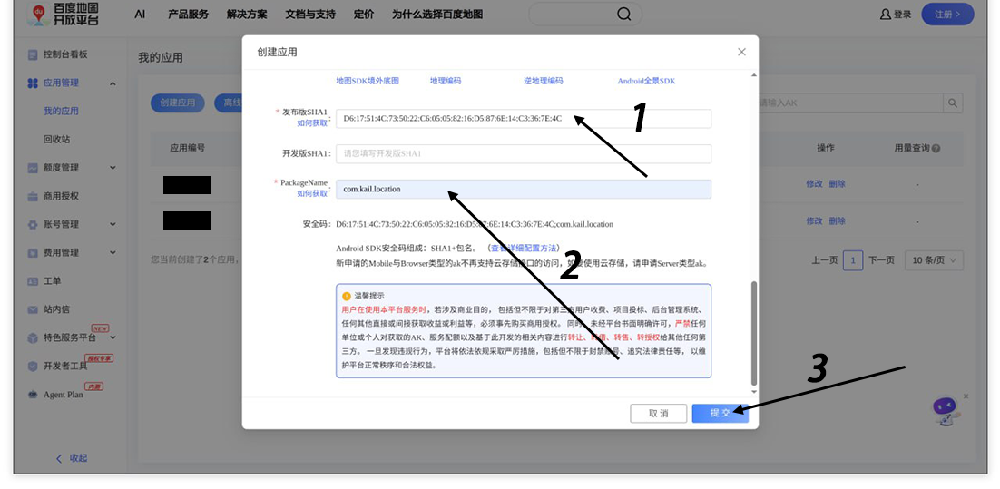
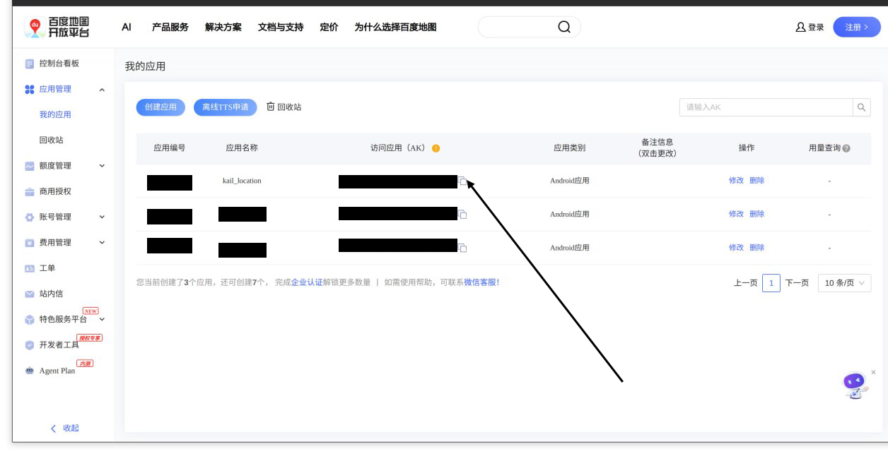

# 申请百度地图 API Key 教程

## 前置条件

- 一个百度账号（如没有，请先注册，实名，选择个人开发者）

## 申请步骤

### 1. 登录百度地图开放平台

打开 [百度地图开放平台](https://lbsyun.baidu.com/)，点击右上角「登录」。

### 2. 进入控制台

登录后，将鼠标悬停在右上角用户名上，点击「控制台」，或直接访问 [控制台](https://lbsyun.baidu.com/apiconsole/key)。

### 3. 创建应用

在控制台页面，点击「创建应用」按钮。

### 4. 填写应用信息

- **应用名称**: 自定义名称，例如 `kail_location`
- **应用类型**: 选择 **Android应用**

  

- **Android 签名证书指纹 (SHA1)**: 填写:
- **包名**: 填写应用的包名，`com.kail.location`

  

### 5. 提交并获取 AK

填写完成后点击「提交」，页面会生成一个 **访问应用（AK）**，即 API Key。

在应用设置填入重启应用即可